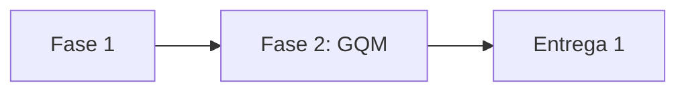

# Metodologia

!!! info "Em construção"
    Esta seção ainda será preenchida pela equipe.

## Fluxo de trabalho da equipe

<!-- Como a equipe se organizou: reuniões, divisão de tarefas, ferramentas. -->

## Etapas

## Ferramentas utilizadas

| Ferramenta | Uso |
|---|---|
| GitHub | Versionamento, issues e GitHub Pages |
| MkDocs Material | Geração deste site |
