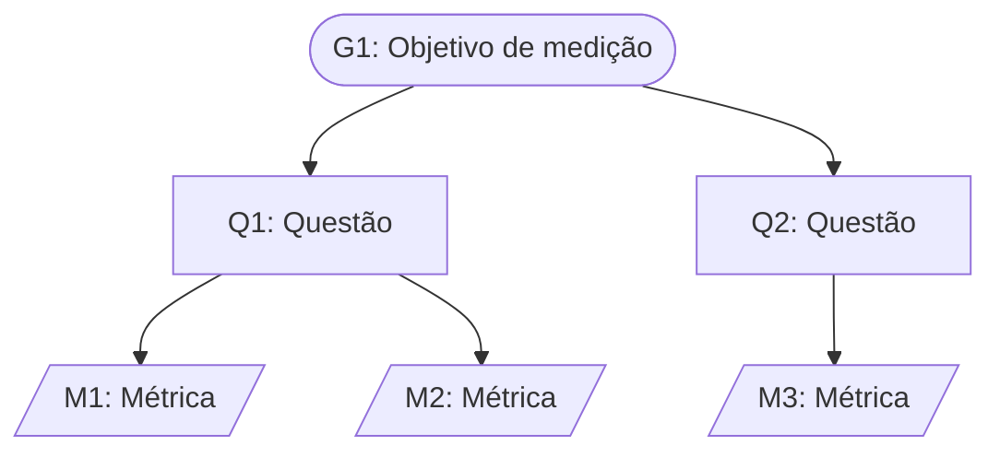

# Gráfico GQM

Exemplo de estrutura — substitua pelos objetivos, questões e métricas da equipe.

```mermaid
flowchart TD
    G1([G1: Objetivo de medição])
    G1 --> Q1[Q1: Questão]
    G1 --> Q2[Q2: Questão]
    Q1 --> M1[/M1: Métrica/]
    Q1 --> M2[/M2: Métrica/]
    Q2 --> M3[/M3: Métrica/]
```
